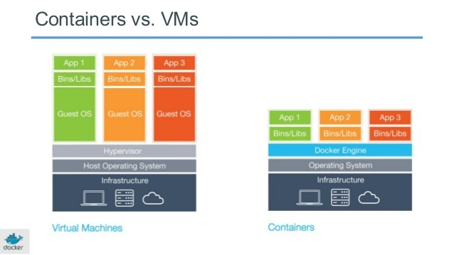
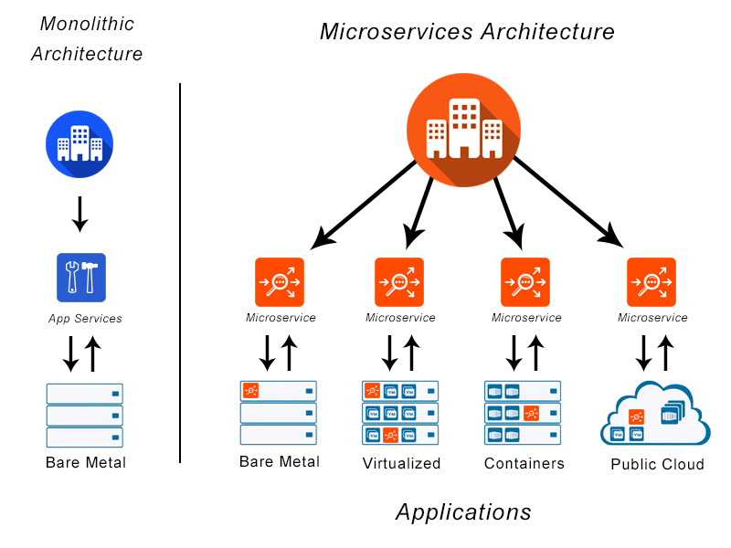

# What is docker?

- Docker is an open platform for developing, shipping, and running applications. 
- Docker enables you to separate your applications from your infrastructure so you can deliver software quickly.
- With Docker, you can manage your infrastructure in the same ways you manage your applications.
- Docker’s methodologies for shipping, testing, and deploying code quickly, can significantly reduce the delay between writing code and running it in production

## Why we should use docker instead of VMs
- Docker containers are much smaller and require far fewer resources than a VM.
- Docker is fast. While a VM can take an at least a few minutes to boot, it takes anywhere from a few milliseconds to (at most) a few seconds to start a Docker container from a container image.
- Containers can be shared across multiple team members, bringing much-needed portability across the development pipeline. This reduces ‘works on my machine’ errors that plague DevOps teams.

 

### Top Technologies Running Docker
- NGINX: The name is pronounced like “Engine-Ex”. NGINX is an open source web-server. It is used to deploy and run HTTP servers. It has excelled a long way after it’s public launch in 2004. NGINX also improves security and scalability of the busiest websites.
- REDIS: Redis is used as a database, cache, and a message broker. It is open source and BSD licensed. The main difference between Redis and other databases is that Redis stores and manipulates high-level data types with ease. The use of Redis is growing rapidly.
- POSTGRESQL: When it comes to relational database, PostgreSQL tops. It is climbing the steps of popularity pretty quick! It is a combination of SQL language and many other features. PostgreSQL is considered to be the most advanced open source database system.
- ELASTICSEARCH: Elasticsearch is built on Apache Lucene and is released under the Apache license terms. It is an open-source, distributed data store and full-text search engine. It is suitable for modern container environments.
- FLUENTD: The use of Fluentd has boosted up like anything. It unifies the data collection and consumption for optimum use. It also helps in understanding the data. Fluentd is open source.
- MONGO: Mongo or MongoDB is a widely used document store. In terms of Docker, we notice that its use is less, but otherwise, it is variedly used. Many modern-day web applications use MongoDB.

#### The top 5 companies using docker is:
- JPMorgan Chase
- ThoughtWorks
- Inc.
- Docker
- Inc.
- Neudesic 
- SLALOM, LLC.

## What is Micro-services architecture

- Microservice architecture – a variant of the service-oriented architecture structural style – arranges an application as a collection of loosely-coupled services. In a microservices architecture, services are fine-grained and the protocols are lightweight

## Microservices vs Monolith

- The monolithic architecture is considered to be a traditional way of building applications. A monolithic application is built as a single and indivisible unit. Usually, such a solution comprises a client-side user interface, a server side-application, and a database. It is unified and all the functions are managed and served in one place.

### Copying to nginx
`docker cp [path to file] [docker container id]:[path to destination]`
- In this case I copied over an index file into the container to replace the default nginx one. I can now freely make changes to the file and it will be updated and displayed on the localhost.

## Creating a Dockerfile
- build an image to automate the task to launch a static webserver using nginx with Docker
- Using nginx webserver with Docker
- Use the official image nginx
- lable it wuth your name or email
- Copy the folder/file from local host to the container
- declare to use default port 80 for nginx

- building customised docker images

 `FROM` is the keyword to use the image 

`FROM nginx`

- lable it with your email or name - this is optional
`LABEL MAINTAINER=dhassan@sparta`

- Copy the data as our index.html
`COPY index.html /usr/share/nginx/html`
- copy index.html to the nginx default index.html
- Now let's add the port
`EXPOSE 80`

`CMD ["nginx", "-g", "daemon off;"]`
- we get this from the offical image of nginx

## Building the image
`docker build -t [USERNAME]/[REPO NAME] .`

